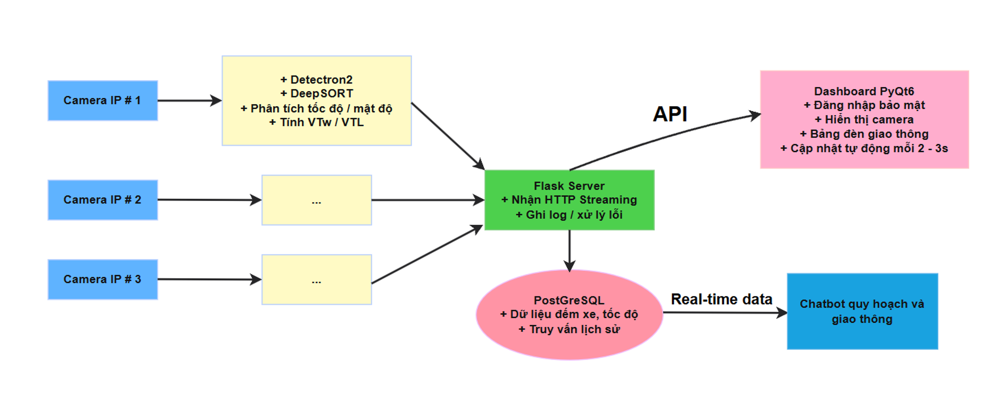

# 📊 Intelligent Traffic Surveillance System with Integrated Traffic ViVi Chatbot

## 📌 Project Overview

This project is designed to address the challenges of **urban traffic monitoring and signal control** by combining **real-time computer vision** with **natural language AI**.

It consists of two main components:

- **Smart Traffic Camera System** – applies deep learning models to detect and track vehicles, analyze traffic flow, and dynamically control traffic lights. The model has been **fine-tuned on real-world data** and optimized for deployment using **ONNX, TensorRT, and OpenVINO**.

- **Traffic Chatbot with Agent + LLM + RAG** – allows users to query traffic data and urban planning documents using natural language. The chatbot uses a **fine-tuned LLAMA3.2‑3B model**, powered by **AI Agent and Smart Retriever** for accurate and context-aware responses.

---

## 📷 1. Smart Traffic Camera System

The camera system processes real-time video input from intersections and applies the following techniques:

### 🎞️ Image and Video Processing
- Preprocessing using RGB/HSV color spaces, Gaussian blur, and Canny edge detection
- Geometric transformations: Homography and Perspective Transform

### 🧠 Vehicle Detection and Tracking
- Detection using **Faster R-CNN with FPN** (fine-tuned)
- Object tracking with **DeepSORT + TorchReID**

### 🕒 Speed Estimation and Signal Control
- Estimate speed using pixel-to-distance conversion (MPP) via perspective transform
- Apply **Exponential Moving Average (EMA)** to smooth vehicle count over time
- Use linear regression to detect cycle changes in traffic flow
- Automatically adjust signal timing (green/red lights) based on traffic density

### 🚀 Inference Optimization
- Model is converted and deployed using **ONNX**, **TensorRT**, and **OpenVINO** to enhance performance across devices

---

## 💬 2. Traffic Chatbot System (AI Agent + LLM + RAG)

The chatbot enables users to ask traffic or planning-related questions in natural language, and generates responses from:

- A reasoning **AI Agent** that enhances interaction with memory and feedback-driven adaptation
- **Real-time traffic data** stored in PostgreSQL
- **Preprocessed urban planning documents** (PDF, JSON)

### 🧠 Urban Planning Document Processing
- Semantic chunking + embedding vectors for each paragraph
- Three retrieval strategies:
  - FAISS Semantic Index
  - BM25 + Pinecone
  - Reranker
- Combine results into a **Smart Retriever – Planning**, and pass context to the fine-tuned LLM for final answer generation

### 📡 Real-time Camera Data Query
- Periodically fetches data from PostgreSQL
- Creates a **Smart Retriever – Real-time** using the same 3-step strategy
- Compares semantic similarity between real-time and planning data to pick or combine the most relevant source

---

### 🤖 AI Agent Integration (LangGraph + ReAct Strategy + Feedback Loop)
The chatbot is enhanced with an **AI Agent** module that enhances its ability to reason, act, and adapt through:

- **Reasoning flow** via LangGraph to manage the interaction process.
- **ReAct (Reason + Act) prompting**: The agent iteratively reasons about the user's query and decides when to act using tools.
- **User feedback awareness** to track repeated failures.
- **Prompt adaptation**: Automatically rewrites unclear or poorly understood questions.
- **Memory mechanism**: Remembers past interactions for continuity.

```text
User Input
   ↓
Dual Retriever (Planning + Real-time)
   ↓
Context to LLM
   ↓
ReAct logic
   ├─ Reason about intent
   ↓
AI Agent (Feedback-Aware)
   ├─ LLM generates answer
   ├─ Feedback classified (positive/negative)
   ├─ If negative:
   │   ├─ Retry with updated prompt
   │   └─ Rewrite unclear questions
```

- ✅ Benefits of the Agent-Augmented System
     - 📚 Reason before action: ReAct allows the agent to decompose problems before acting
     - 🔁 Resilience to unclear input – the agent rewrites vague or failed prompts
     - 🧠 Memory-based learning – learns from bad feedback over time
     - 🎯 Dynamic strategy – swaps retrieval context, changes prompt format if repeated failure is detected
     - 🔍 Tool-aware – uses web search and custom retrievers when document context is weak

---

### 🔔 Note – `SQL_Agent/` Module

Inside the `Chatbot_Traffic/` folder, there's a subfolder named **`SQL_Agent/`**, which is a **custom-built module using LangGraph** that enhances the chatbot’s ability to **query the PostgreSQL database** efficiently and intelligently.

| **Component** | **Description** |
|---------------|------------------|
| **LLM-powered SQL generation** | Uses **StarCoder 2 3B** (via HuggingFace Transformers) to generate SQL based on schema and user questions |
| **LangGraph workflow** | Implements a **state graph workflow**: generate SQL ➜ execute ➜ detect/fix error ➜ re-run ➜ finalize |
| **Error memory (`sql_error_memory.json`)** | Stores previously seen SQL errors and corrections for reuse, reducing LLM calls and speeding up responses |
| **Auto-repair mechanism** | When an error occurs, the agent prompts the LLM with context to generate an improved SQL query (with retry limits) |
| **Results** | Returns the final SQL, query results, and a detailed history of any error-fixing steps for debugging |

> **Summary:** The `SQL_Agent/` module allows the chatbot to **automatically generate, execute, and fix SQL queries**, ensuring **fast and accurate data retrieval** from the real-time traffic database.

---

## 🗃️ Dataset & PostgreSQL Schema
The system relies on a well-structured PostgreSQL database to store real-time and historical traffic data, support analytics, and enable natural language queries via the chatbot.

### 🔹 Database Tables
- `users`: stores account information and roles.
- `cameras`: stores camera metadata and location.
- `vehicle_stats`: captures vehicle counts by time slot, direction, and type.
- `avg_speeds`: stores average speed of traffic by camera and time.
- `camera_area`: maps cameras to administrative areas.
- `areas`: defines geographical or administrative areas.
- `daily_traffic_summary`: aggregates traffic metrics per day.
- `traffic_events` (optional): logs special traffic events (e.g., congestion, accidents).

### 🔸 Schema Diagram
```text
┌────────────┐
│   users    │
├────────────┤
│ id (PK)    │
│ username   │
│ password   │
│ full_name  │
│ role       │
│ created_at │
└────┬───────┘
     │
     ▼
┌────────────┐            ┌────────────────────┐
│  cameras   │───────────▶│   vehicle_stats     │◀────────────┐
├────────────┤            ├────────────────────┤             │
│ id (PK)    │            │ id (PK)            │             │
│ name       │            │ camera_id (FK)     │             │
│ location   │            │ date (DATE)        │             │
│ installed  │            │ time_slot (0–47)   │             │
└────┬───────┘            │ direction          │             │
     │                    │ vehicle_type       │             │
     │                    │ vehicle_count      │             │
     │                    └────────────────────┘             │
     │                                                       │
     ▼                                                       │
┌────────────────────┐                                       │
│    avg_speeds      │                                       │
├────────────────────┤                                       │
│ id (PK)            │                                       │
│ camera_id (FK)     │                                       │
│ date (DATE)        │                                       │
│ time_slot (0–47)   │                                       │
│ average_speed      │                                       │
└────────────────────┘                                       │
     ▲                                                       │
     │                                                       │
     │                                                       ▼
┌────────────────────┐                            ┌────────────────────────────┐
│   camera_area      │                            │ daily_traffic_summary      │
├────────────────────┤                            ├────────────────────────────┤
│ id (PK)            │                            │ id (PK)                    │
│ camera_id (FK)     │                            │ camera_id (FK)             │
│ area_id (FK)       │                            │ date (DATE)                │
│ location_detail    │                            │ total_vehicle_count        │
└────────┬───────────┘                            │ avg_speed                  │
         │                                        │ peak_time_slot             │
         ▼                                        │ direction_with_most_traffic│
┌────────────────────┐                            └────────────────────────────┘
│      areas         │
├────────────────────┤
│ id (PK)            │
│ name               │
│ description        │
└────────────────────┘

             (Optional)
                   ▲
                   │
                   ▼
        ┌────────────────────┐
        │   traffic_events   │
        ├────────────────────┤
        │ id (PK)            │
        │ camera_id (FK)     │
        │ event_time         │
        │ event_type         │
        │ description        │
        └────────────────────┘
```
---

## 🧩 System Architecture

### 📷 Camera Monitoring Pipeline
- Real-time video → Object Detection → Tracking → Traffic Flow Analysis → Signal Control


### 🤖 Chatbot + SQL Agent System
- Natural language → Smart Retriever → Document/Camera Query → SQL Generation → Answer


---

## ✅ Key Features

1. Ingest and process live video streams from traffic cameras  
2. Detect and classify vehicles using deep learning  
3. Track vehicles across video frames  
4. Segment movement direction for flow analysis  
5. Calculate traffic metrics: vehicle count, average speed, density  
6. Estimate signal control metrics (VTw and VTL) per direction  
7. Make real-time traffic light decisions automatically  
8. Log system states: vehicle count, speed, signal duration  
9. Provide API access for dashboards and external systems  
10. Support for edge-based or cloud-integrated multi-camera networks  
11. Enable chatbot interactions with support for natural language traffic or planning queries  
12. Generate responses using **LLM + RAG**: combining real-time data and preprocessed planning documents  
13. Integrate AI Agent using **ReAct (Reason + Act)** to enable tool-based reasoning, self-correction, and dynamic tool chaining  
14. Multi-strategy semantic retrieval pipeline: FAISS, BM25, and reranking via embedding models  
15. Learn and adapt over time through memory tracking and user feedback loop  

---
## ✍️ Author
**Đặng Kim Thành**
**Bùi Quốc Khang**  
4th-Year Student, HCMC University of Technology and Education  
Specialization: Artificial Intelligence


